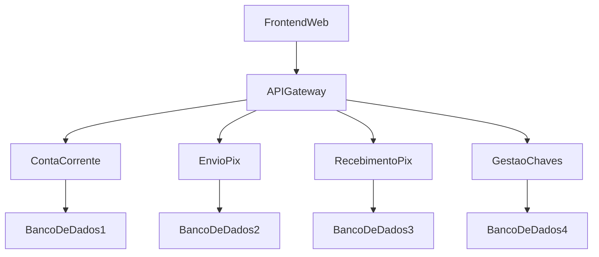

# BIX - Boiko's Pix Project

Este é um projeto de simulação do Pix, onde estamos desenvolvendo uma plataforma para realizar transações financeiras de forma rápida e segura.

## Visão Geral

O projeto "BIX" é uma simulação do sistema de pagamentos instantâneos brasileiro, o Pix. O objetivo é desenvolver uma aplicação que permita aos usuários realizar transações entre contas correntes utilizando chaves de identificação, de forma semelhante ao funcionamento do Pix. Futuramente podemos escalar este projeto para algo mais complexo.

## Microsserviços

O projeto é organizado em microsserviços, cada um responsável por uma parte específica da funcionalidade do sistema. Atualmente, os microsserviços planejados são:

- **Conta Corrente:** Responsável por gerenciar informações relacionadas às contas dos usuários.
- **Envio de Pix:** Responsável pelo processamento de transações de envio de Pix.
- **Recebimento Pix:** Responsável pelo processamento de transações de recebimento de Pix.
- **Gestão de Chaves:** Responsável pelo gerenciamento das chaves Pix dos usuários.

## Tecnologias

Cada microsserviço pode ser desenvolvido em uma tecnologia diferente, conforme as necessidades e preferências da equipe. Algumas tecnologias que podem ser consideradas incluem:

- Conta Corrente: (Preencher aqui as tecnologias)
- Envio de Pix: (Preencher aqui as tecnologias)
- Recebimento Pix: (Preencher aqui as tecnologias)
- Gestão de Chaves: (Preencher aqui as tecnologias)

  ### Bancos de Dados

  A ser discutido

## Diagrama de Arquitetura (Alto Nível)

## Contribuição

## Contato

